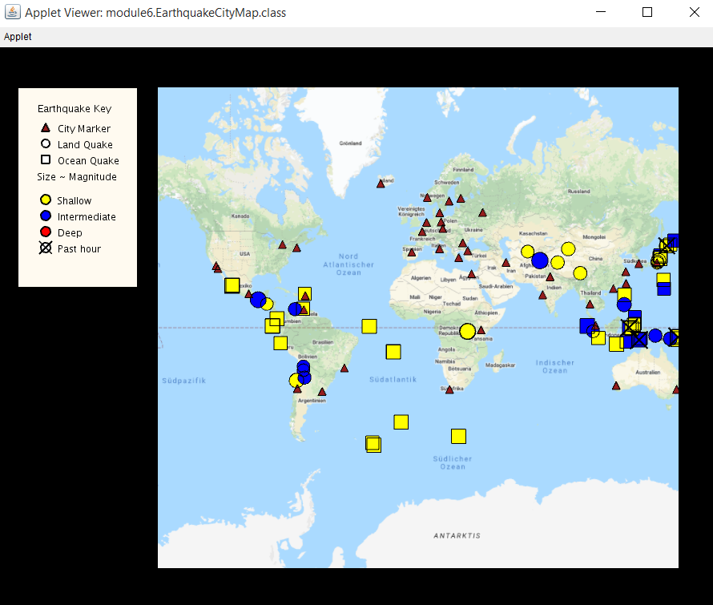
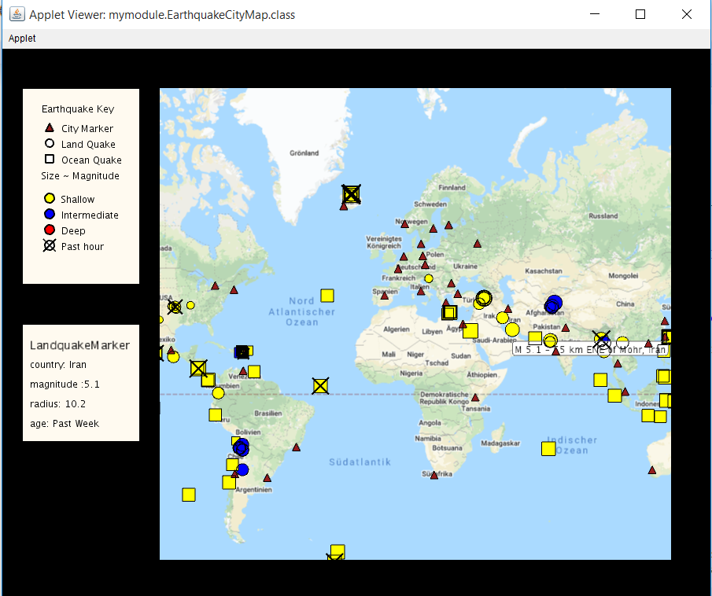
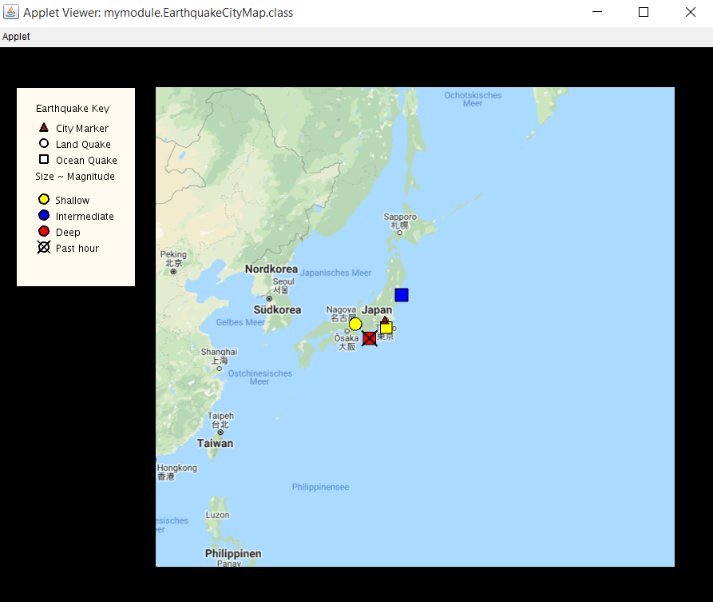

# UnfoldingMaps
I did this project as a part of Object-Oriented Programming Course in Coursera. This project is about representing earthquakes on a map using different kinds of markers based on their properties. This project helps in understanding the real time use of OOP concepts.
## Overview
This is an application with an interactive map displaying earthquake data. I worked on this application as a part of Coursera's Object Oriented programming course. The objective of this project is to reperesent earth quakedata on a map using markers. Here the earthquakes are again classifed based on the their magnitude,depth and place(land/water) they occured. The size, shape and color of markers varies depending upon the magnitude,place and depth of the quakes. Along with earthquakes some of the cities are also represented on the map. It can be seen it the image below - 

  
Finaloutput.png

  
   
   

**Features**

Along with displaying markers the map also responds to mouse events such as zoomin and zoomout. This application has two features responding to mouse hovers and mouse clicks.

* If the mouse is hovered on any of the markers, then the details of the marker will be shown on a popup in the bottom left corner of the canvas. The popup will be shown until the curser is moved away.  It can be seen in the below image - 
    

      
hover.png

  
     

    

* The second feature is responding to mouse clicks. Whenever a quake marker is clicked all other markers will be hidden except the some city markers which are affected by that quake. When a quake marker is clicked all the city markers will be checked, whether they are in the effected distance. Caluculating whether a city is in the threat circle of earth quake is not real, it's just a sample function implemented in [EarthquakeMarker class](src/EarthquakeMarker.java). This feature can be seen in the below image - 

     

          
clicked.png

  

     

     
## Set up
For this project we need eclipse for better coding enviroment and Java JDK. Note that you need to use correct version of java. This project is tested on java versions 7 and 8. Refer the below documents for more detalis on setting up ther requirements.
* [Windows/Linux](Instructions/Setting-Up-Java-and-Eclipse-Mac.pdf)
* [Mac](Instructions/Setting-Up-Java-and-Eclipse-Mac.pdf)
## References 
In this project we need to refer the UnfoldingMaps Library and Processing Library.
* [UnfoldingMaps](http://unfoldingmaps.org/javadoc/)
* [Processing Library](https://www.processing.org/reference/)
